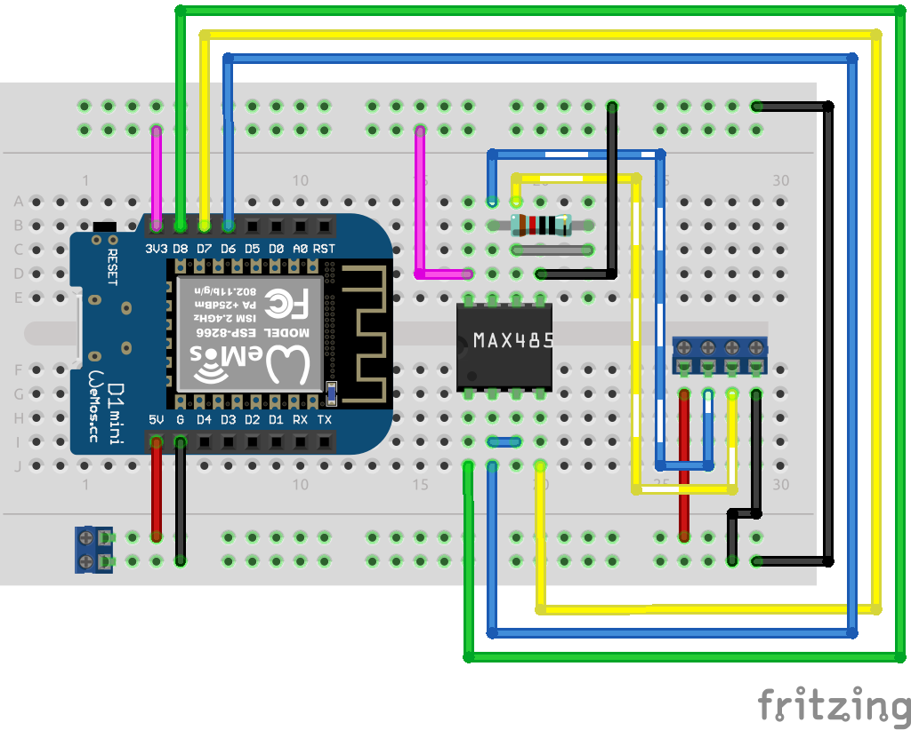

# signalk-pzem017

ESP8266 reading Peacefair PZEM-017 values over ModbusRTU and passing date to SignalK server.

Voltage and current sensor based on [Peacefair PZEM-017](http://en.peacefair.cn/products/610.html) with 200A/75mV shunt. The sensor can be ordered e.g. from AliExpress.

## Libraries Used

 * [PlatformIO](https://platformio.org/)
 * [modbus-esp8266](https://github.com/emelianov/modbus-esp8266)
 * [EspSoftwareSerial](https://github.com/plerup/espsoftwareserial/)
 * [EspSigK](https://github.com/mplattu/EspSigK)

## Equipment

 * Wemos D1 ESP8266
 * Peacefair PZEM-017
 * 200A/75mV shunt
 * MAX3485
 * 120 ohm resistor

## Wiring

Power Connector (two pins):
 1. 5V DC for ESP8266 (red)
 1. GND DC for ESP8266 (black)

Modbus Connector (four pins):
 1. Modbus 5V DC (red)
 1. Modbus A (striped blue)
 1. Modbus B (striped yellow)
 1. Modbus GND (black)

## PCB

 * [Fritzing file](pcb/esp8266_pzem017.fzz)

## Configuration

 * Copy template file `lib/settings.cpp.sample` as `lib/settings.cpp`
 * Edit according to your environment
 * `make upload`

## OTA update

To enable OTA update set OTA password (variable `otaPass` in `settings.cpp`) to non-empty
string.

To update image using PlatformIO `pio` tool:

`PLATFORMIO_UPLOAD_FLAGS="--auth=ota-password" pio run -t upload --upload-port device.ip.address`

Or with zeroconf address (`hostname` is your `wifiHostname` defined in `settings.cpp`):

`PLATFORMIO_UPLOAD_FLAGS="--auth=ota-password" pio run -t upload --upload-port hostname.local`
